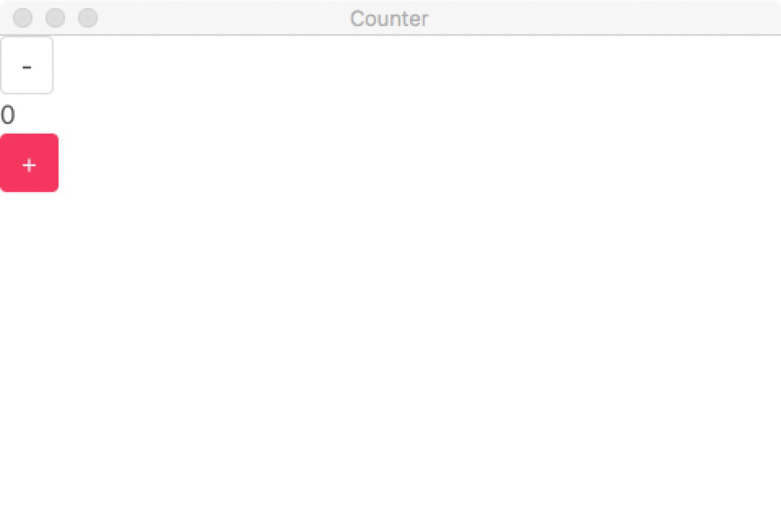

# Counter Demo

> Desktop counter application in Go + Elm + Lorca

The code base demonstrates how to use Lorca, Go and Elm to create a desktop application that handles a simple counter.

## Features

* Small application size (10-11MB)
* Styling uses [Bulma](https://bulma.io/) but could use any CSS framework.
* UI is written in [Elm](https://elm-lang.org/)
* Backend is written in [Go](https://golang.org/)
* Embed all assets into a single binary.



## Commands

Command             |Description
--------------------|-----------
```make deps```     | Install the dependencies
```make exe```      | Create an executable binary (MacOS)
```make test```     | Run the tests
```make beautify``` | Make the code beautiful


## Contributors

Thanks to the Elm, Go, and Lorca community for providing, among other things, examples of basic counters.

More specifically:

[Lorca contributors](https://github.com/zserge/lorca/graphs/contributors).

## License

Code is distributed under MIT license, feel free to use it in your proprietary projects as well.

