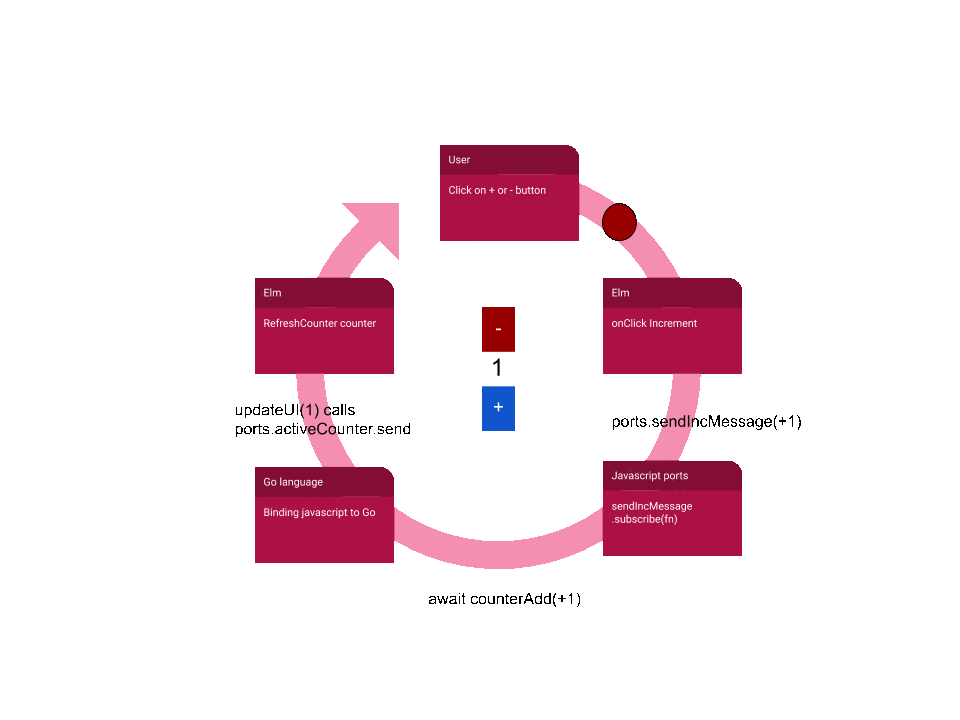

# Counter Demo

> Desktop counter application in Go + Elm + Lorca

This code base demonstrates how to use Lorca, Go and Elm to create a desktop application that handles a simple counter.

## Features

* Small application size (10-11MB)
* Styling uses [Bulma](https://bulma.io/) but could use any CSS framework.
* UI is written in [Elm](https://elm-lang.org/)
* Backend is written in [Go](https://golang.org/)
* Embed all assets into a single binary.
* Examples of unit tests for both Go and Elm



## Limitations

* Requires Chrome/Chromium >= 70 to be installed.
* Optimized and tested for MacOS (any volunteers for other OS ?)

## Commands

Command             |Description
--------------------|-----------
```make deps```     | Install the dependencies
```make exe```      | Create an executable binary (MacOS)
```make test```     | Run the tests
```make beautify``` | Make the code beautiful

## Contributors

* **Olivier Huin** - *Initial Elm support for Lorca* - [olih](https://github.com/olih)

See also the list of [contributors](https://github.com/olih/go-elm-lorca-counter/graphs/contributors)

Also, thanks to the Elm, Go, and Lorca community for providing, among other things, examples of basic counters.

Including:

[Lorca contributors](https://github.com/zserge/lorca/graphs/contributors).

## Contributions

Contributions are welcome, especially:
* [x] Compilation and manual testing under Windows
* [x] Compilation and manual testing under Linux

## License

This project is licensed under the BSD 3-Clause License - see the [LICENSE.md](LICENSE) file for details